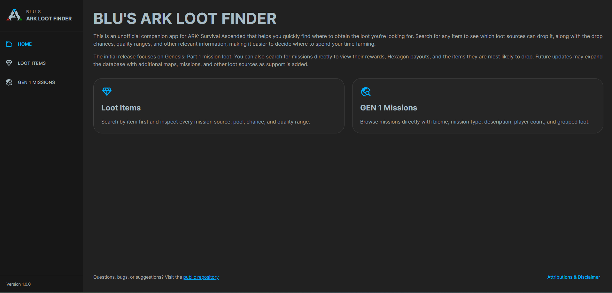
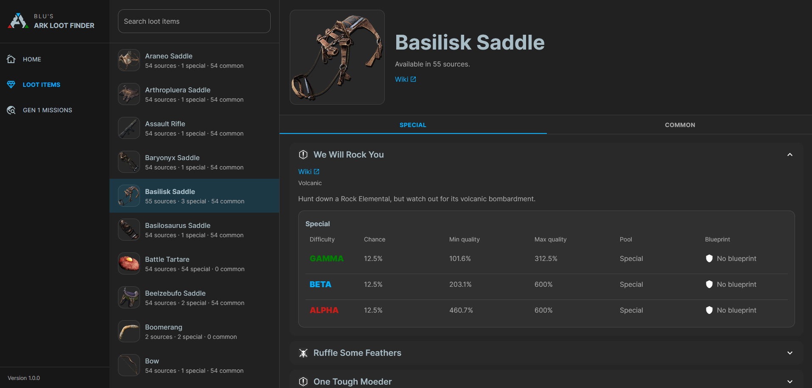
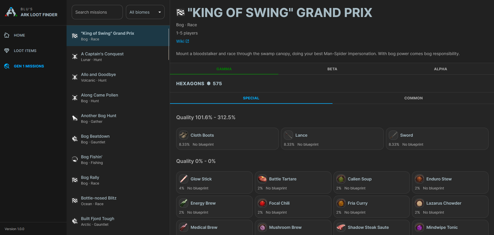

## Blu's ARK Loot Finder

Blu's ARK Loot Finder is a release repository for the desktop builds of Blu's ARK Loot Finder.

The application helps you explore ARK loot drops in two ways:

- `Loot Items`: start from an item and see which missions can drop it
- `Genesis Pt. 1 Missions`: start from a mission and inspect its metadata and loot tables directly

This repository is public and is intended for:

- release downloads
- release notes
- attribution and licensing information
- screenshots and usage docs

The full source code lives in the private source repository.

## Downloads

Download binaries from the repository's GitHub Releases [page](https://github.com/BluTheMermaid/blus-ark-loot-finder/releases).

Each release is expected to provide:

- `BlusArkLootFinder_<version>_setup.exe`
- `BlusArkLootFinder_<version>.zip`

## Which file should I use?

### Windows installer

Use the `.exe` if you want the normal desktop installation experience.

### Portable ZIP

Use the `.zip` if you want to run the Quarkus app directly from a portable bundle.

The ZIP contains:

- `BlusArkLootFinder.jar`
- `run-BlusArkLootFinder.bat`
- `run-BlusArkLootFinder.sh`

### How do I run the portable ZIP?

#### Windows

- Extract the ZIP first
- Open the extracted folder
- Double-click `run-BlusArkLootFinder.bat`

If Windows shows a security prompt, choose the option to continue running the file.

If the app starts but your browser does not open automatically, go to:

- `http://127.0.0.1:8080`

#### macOS / Linux

- Extract the ZIP first
- Open the extracted folder
- Open a terminal in that folder
- Run:

```bash
chmod +x run-BlusArkLootFinder.sh
./run-BlusArkLootFinder.sh
```

If your file manager supports it, you can also try launching `run-BlusArkLootFinder.sh` directly, but using the terminal is the most reliable option.

If the app starts but your browser does not open automatically, go to:

- `http://127.0.0.1:8080`

## Quick Links

- [CHANGELOG.md](CHANGELOG.md)
- [ATTRIBUTIONS.md](ATTRIBUTIONS.md)
- [LICENSE.txt](LICENSE.txt)
- [docs/install.md](docs/install.md)
- [docs/system-requirements.md](docs/system-requirements.md)
- [docs/faq.md](docs/faq.md)

## Screenshots

### Home

### Loot Items

### GEN 1 Missions

